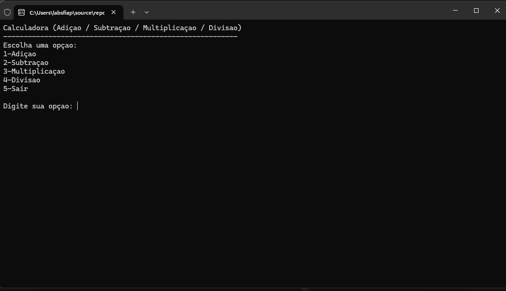
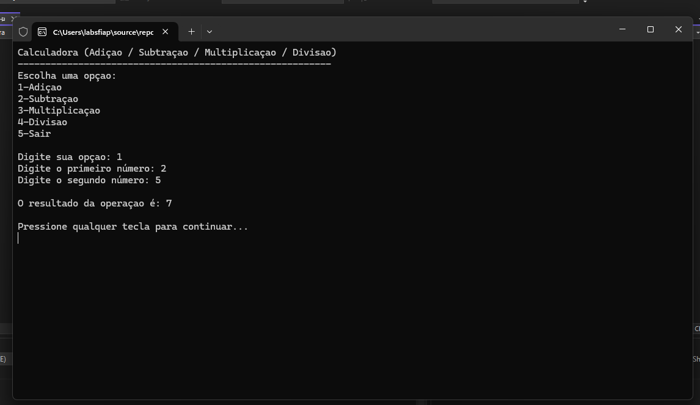
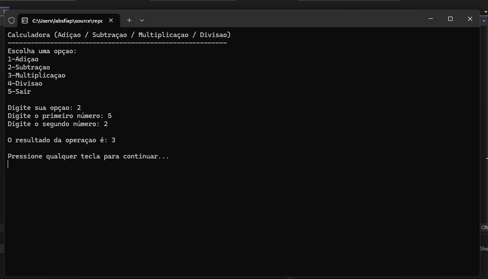
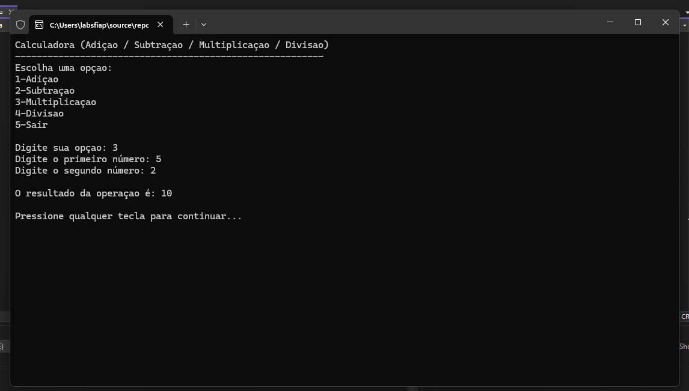
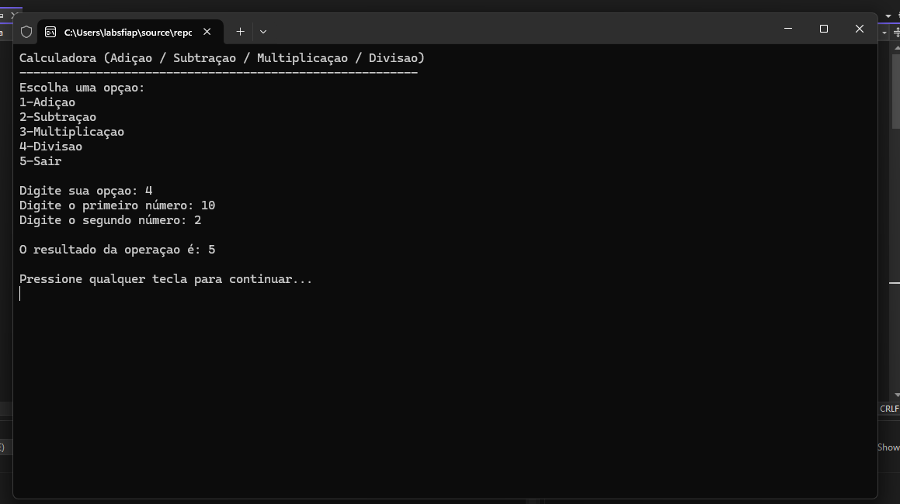
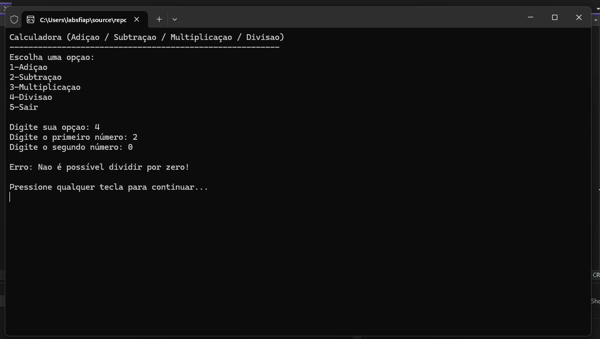

# Checkpoint 1 - Calculadora Console C#

Este projeto consiste em uma calculadora funcional desenvolvida em C# para o ambiente de Console. O objetivo é aplicar conceitos de lógica de programação, estruturas de repetição e tratamento de erros.

## 👥 Integrantes do Grupo
* Gustavo Moreno Coelho - RM556289
* Nicolas Aquino Borges - RM556617
* Dayana Ticona Quispe - RM558023
* Matheus Alves - RM555177
* Gustavo Atanazio dos Santos - RM559098

---

## 📸 Evidências de Teste

### 1. Menu Inicial
Aqui apresentamos a tela principal com as opções de operação conforme solicitado.

### 2. Operação de Adição
Teste realizado com a soma de dois valores.

### 3. Operação de Subtração
Teste realizado com a subtração de dois valores.

### 4. Operação de Multiplicação
Teste realizado com a multiplicação de dois valores.

### 5. Operação de Divisão
Teste realizado com a divisão de dois valores, incluindo o tratamento de erro para divisão por zero.

### 6. Operação de Divisão por Zero
Teste realizado com a divisão de um valor por 0, evidenciando o tratamento de erro para divisão por zero.

---

## 🛠️ Tecnologias Utilizadas
* Linguagem: C#
* Ambiente: .NET Console Application
* Versionamento: Git/GitHub
